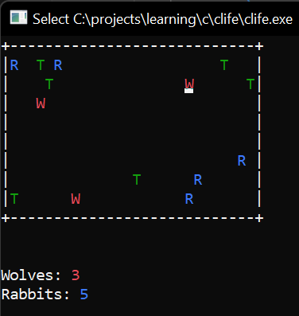

# clife

Learning solo project that I did to understand how to make a small project using only C. 

And... OH MY GOD C is hard! I really miss my C# features, but it was fun indeed!

It represent a simple life simulation competing for resources.

**As of now it is not working as intended. Will I ever finish this and fix it? Hope so**
